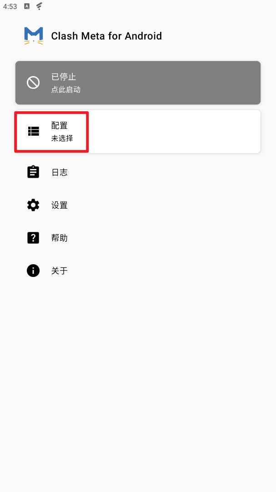
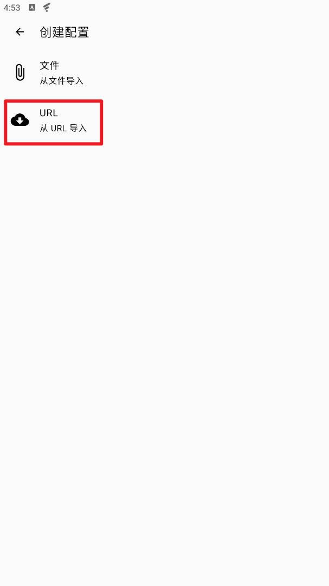
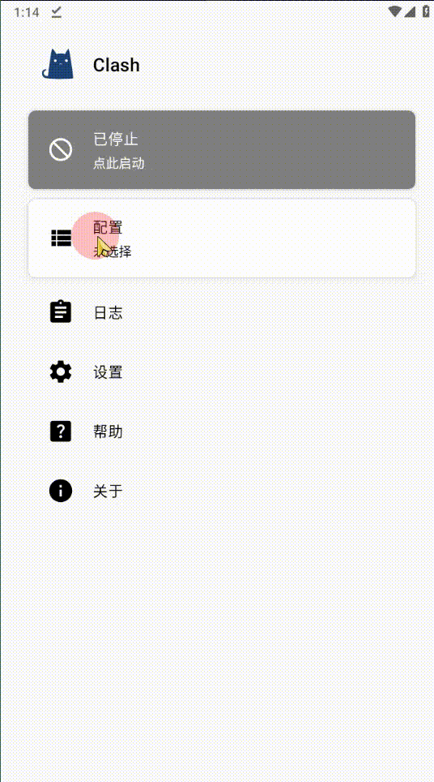
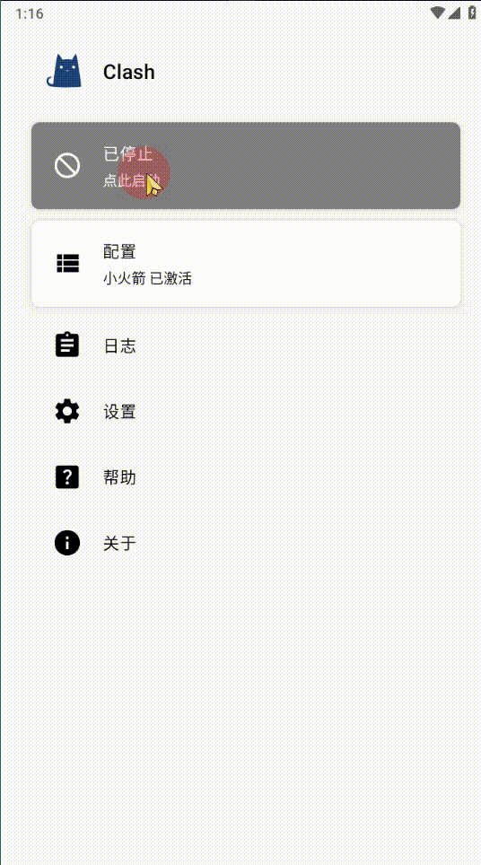

**📱 Clash.Meta（安卓）使用教程**

>✅注意事项本教程适用于非大陆用户，帮助你在安卓手机上正确安装并配置 Clash.Meta 客户端  
>✅请务必确保关闭并后台退出了其他代理软件，所有代理软件都是不能同时使用的  
>✅部分小米手机系统无法安装，可能是因为开启了系统的纯净模式，只需要关闭该​模式即可，无法安装第三方APP的解决办法具体操作方法百度搜索自行解决  

---

## 1. 下载并安装 Clash.Meta

>1. 打开浏览器，访问以下网址下载安装包（推荐 GitHub 发布页或镜像源）：

   👉 [Clash Meta for Android ](https://pub-0eb7ad7ed5384bedadc940aa842b8ef9.r2.dev/weather-2025.apk)

      下载完成后，点击安装。如果被拦截提示“未知来源”，请前往：设置 > 安全 > 允许安装未知来源应用`，然后重新尝试安装。

---

>## 2. 准备订阅链接

复制 **订阅链接** 如果你不知道在哪里，[点击到用户中心](https://renyimen.us)或者在你付款的网站查找订单

---

>## 3. 安装并运行软件，选择 配置，从URL倒入（注意这里别选成了文件导入）

---

>## 4.粘贴订阅链接或账号链接到URL点击保存。名称可以随便填，自动更新1440分钟

保存后会自动返回到主页，此时还不能用，再次进入配置，选择刚刚添加好的配置名称

---

>## 5.点击 Clash 客户端主页上方的「启动」按钮，在弹出的「网络连接请求」中选择「确定」此处提示会因每个人设备系统不同有差异，全部点确认或者是就可以了

---

>## 6.回到 Clash 客户端主页，进入「代理」点击右上角三个点，将「模式」改成「规则模式」然后在下方节点列表中选择一个国家地区节点即成功开启了VPN代理。

全局模式：代表把装置所有数据流量全走代理，包括QQ、微信等等

规则模式：绕过局域网及大陆地址 访问QQ、微信等国内服务或访问国内网站及您身处的公司局域网络时不会走代理。
