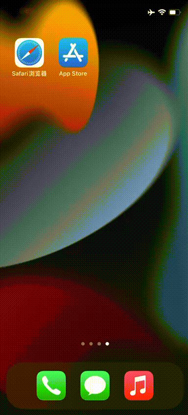

# 🍎 iOS（iPhone / iPad）使用教程 - Shadowrocket 小火箭

本教程适用于非大陆用户，使用美区 Apple ID 下载并配置 Shadowrocket 客户端（也叫“小火箭”）。

⚠️ **继续使用小火箭服务前，请务必查看是否满足以下条件：**

✅ 浏览器访问 [time.is](https://time.is) 检查设备时间是否与北京时间同步  
✅ 我的小火箭会员没有过期  
✅ 设备中没有开启其他 VPN 类软件  
✅ 我的网络不是校园网或者公司内网  

> 💡 **温馨提示**  
> 再次确认你的设备环境是否满足以上条件，检查无误后继续查看使用教程。

---

✅ **客户端下载：**  
>由于 Shadowrocket 在中国大陆地区商店下架且需要付费购买，你可以自行注册美区苹果账户或者自行淘宝拼多多闲鱼购买美区账号（小火箭苹果商店价格2.99美元，此费用是苹果公司收取，充值美元可以购买美区礼品卡一般出售id的地方都有）。
>
>也可以前往官网下载和教程中查看共享美区账号，但对于共享账户的可用性小火箭无法保证（因为只要有人双重认证就得改密码，密码改了就更新不了强烈建议自己持有一个外区ID）。

---

>共享美区ID咨询客服邮箱获取 `强烈建议登录自有美区id`下载shadowrocket,方便各种软件更新和下载，共享ID仅适合应急使用，`共享ID禁止登录iCloud`有锁机风险，只登录App Store即可（某鱼或某宝有卖独享美区ID，可能需要搜索技巧）

连接成功后，可以加入TG群组每次获得共享ID密码变更提醒[点击加入](https://t.me/+RMAHp8JAtpY2NDZh)

官网购买地址发布页 [点击前往](https://renyimen.us) 找到最新的官网地址

---

## 1. 退出国区 Apple ID

>打开「App Store」应用  
> 点击右上角的账户头像  
> 下滑至页面底部，点击「退出登录」

---

## 2.登录美区共享账户##
>  
> 复制小火箭提供的共享账号密码，登录后出现「**Apple ID 安全**」提示。  
>  
> 点击 「其他选项」 → 「不升级」 即可成功登录。

---

## 3. 下载并安装 Shadowrocket

> 点击下方链接跳转 App Store：  
> 👉 [Shadowrocket - App Store](https://apps.apple.com/us/app/shadowrocket/id932747118)

> 直接在 App Store 搜索 `Shadowrocket` 也可  
> 安装完成后务必**退出共享账号**，避免账号异常

---

## 4. 添加订阅

### 方法一：手动导入

>1. 在购买页获得【订阅链接】，复制订阅链接  
>2. 打开 Shadowrocket，点击右上角 `+`  
>3. 点击选择类型，选择【Subscribe】 将复制的订阅链接复制进URL
>4. 在左上角返回主界面，启用节点即可

### 方法二：自动导入（推荐）

>1. 在官网购买页面中，找到“一键导入”点击[点击前往](https://renyimen.top/#/user/center) 
>2. 出现提示“在 Shadowrocket 中打开吗”，点击【打开】  
>3. Shadowrocket 会自动添加订阅地址并打开软件

---

## ✅ 使用建议
-**建议加入tg通知群**：每日更新共享id密码，需要外网环境[点击加入](https://t.me/+RMAHp8JAtpY2NDZh)

-**订阅地址保密**：不要外泄，防止封号  

-**定期更新订阅**：进入软件内点【更新】可刷新节点,如果显示更新失败或异常，可尝试断开任何已经连接的节点再次点更新

-**退出共享账号**：防止设备与 Apple ID 异常绑定

---

如需进一步协助，请联系商家客服获取帮助。